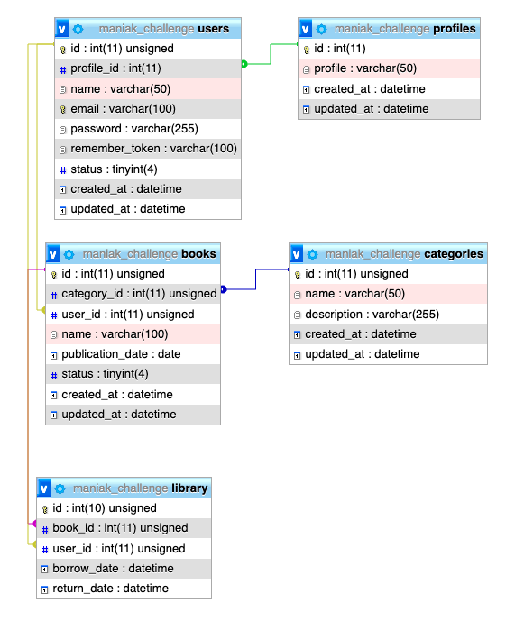
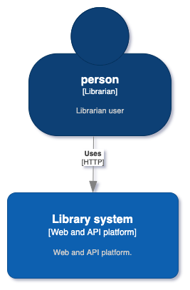
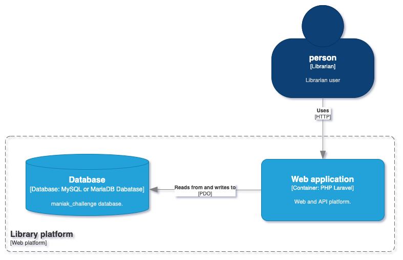
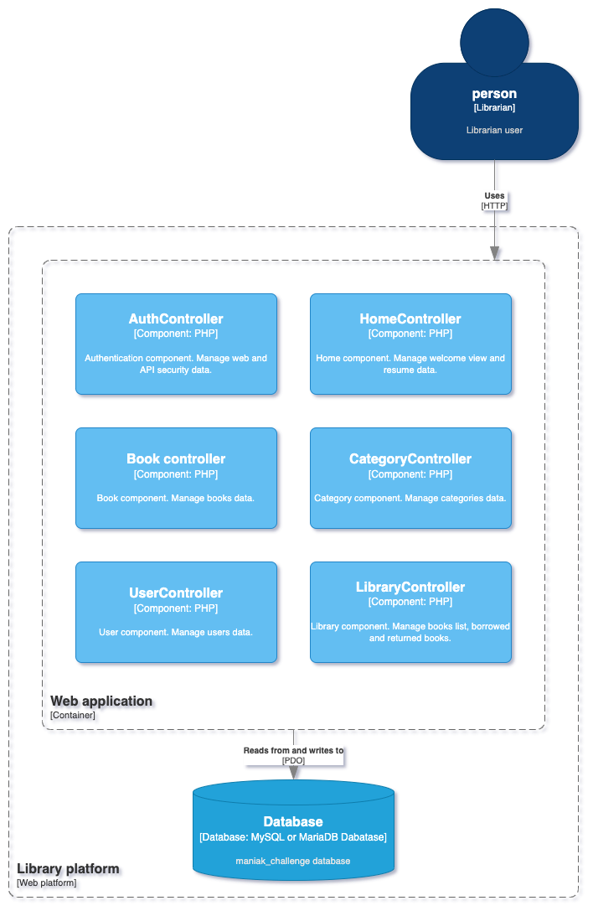
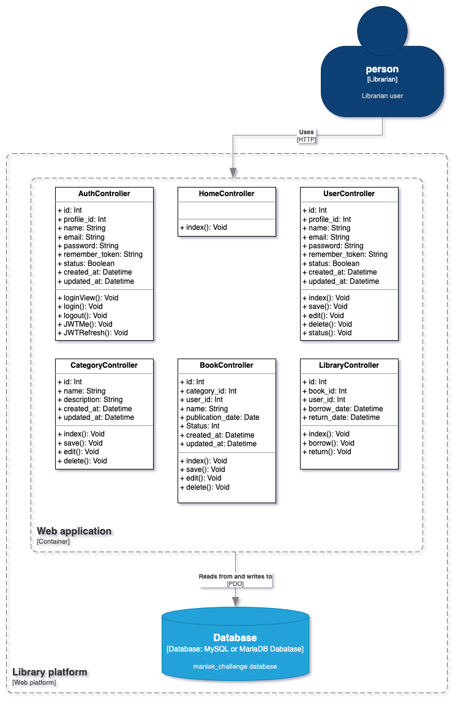

<h1>Technical challenge</h1>

This is the Full stack challenge developed by Epsom Enrique Segura Jaramillo using Laravel framework with Blade Templates, Bootstrap, JQuery and MySQL database.

<h2>How to test this challenge</h2>

<h3>Database</h3>
<ol>
<li>Create a database called <strong>maniak_challenge</strong> into mysql server</li>
<li>Import the SQL script called <strong>maniak_challenge.sql</strong> contained in <a href="./docs/" target="_BLANK">docs</a> directory</li>
</ol>

<h3>Code</h3>
<ol>
<li>Download and extract or clone this repo</li>
<li>Open the project root path on <strong>terminal</strong> and execute <strong>composer update</strong></li>
<li>Update <strong>.env</strong> file changing the database info</li>
<li>Execute the test using <strong>php artisan serve</strong></li>
</ol> 

<h3>Platform</h3>
<ol>
<li>Open <a href="http://localhost:8000">http://localhost:8000</a> on browser</li>
<li>
Use this credentials to login into platform
<ul>
<li>Email: <strong>main@user.com</strong></li>
<li>Password: <strong>main@user.com</strong></li>
</ul>
</li>
<li>Explore the platform</li>
</ol>

<h3>API</h3>
<ol>
<li>Execute the test using <strong>php artisan serve</strong></li>
<li>Open <strong>Postman</strong> or similar alternative</li>
<li>
Use this credentials to login into platform and get a Bearer token
<ul>
<li>Email: <strong>main@user.com</strong></li>
<li>Password: <strong>main@user.com</strong></li>
</ul>
</li>
<li>
Test Rest API using this endpoints:

<table>
<thead>
<tr>
<th>URL</th>
<th>Method</th>
<th>Headers</th>
<th>Params</th>
</tr>
</thead>
<tbody>

<tr><td align="center" colspan="4"><h3>Auth endpoints</h3></td></tr>
<tr>
<td>/api/login <small>Login into platform</small></td>
<td>POST</td>
<td>Null</td>
<td>
<code>
{
"email":"string",
"password": "string"
}
</code>
</td>
</tr>

<tr>
<td>/api/refreshToken <small>Refresh logged user token</small></td>
<td>POST</td>
<td>Null</td>
<td>
<code>
{
"email":"string",
"password": "string"
}
</code>
</td>
</tr>

<tr>
<td>/api/me <small>Get logged user info</small></td>
<td>GET</td>
<td>
<code>
{
    "accept":"application/json",
    "authorization": "bearer token"
}
</code>
</td>
<td>Null</td>
</tr>

<tr>
<td>/api/logout <small>Logout user session</small></td>
<td>GET</td>
<td>
<code>
{
    "accept":"application/json",
    "authorization": "bearer token"
}
</code>
</td>
<td>Null</td>
</tr>

<tr><td align="center" colspan="4"><h3>Home endpoints</h3></td></tr>
<tr>
<td>/api/home <small>Home resume data</small></td>
<td>GET</td>
<td>
<code>
{
    "accept":"application/json",
    "authorization": "bearer token"
}
</code>
</td>
<td>Null</td>
</tr>

<tr><td align="center" colspan="4"><h3>Users endpoints</h3></td></tr>
<tr>
<td>/api/users <small>Read all users data</small></td>
<td>GET</td>
<td>
<code>
{
    "accept":"application/json",
    "authorization": "bearer token"
}
</code>
</td>
<td>Null</td>
</tr>
<tr>
<td>/api/users <small>Create user</small></td>
<td>POST</td>
<td>
<code>
{
    "accept":"application/json","authorization": "bearer token"
}
</code>
</td>
<td>
<code>
{
"profile_id":"number",
"name":"string",
"email":"email",
"password":"password","repeat_password":"repeat_password"
}
</code>
</td>
</tr>

<tr>
<td>/api/users <small>Update user info</small></td>
<td>PUT</td>
<td>
<code>
{
    "accept":"application/json",
    "authorization": "bearer token"
}
</code>
</td>
<td>
<code>
{
    "id":"Encrypted ID contained in data from User list",
    "profile_id":"number",
    "name":"name",
    "email":"email",
    "chngPassword":"if password will be change",
    "password":"password"
    "repeat_password":"repeat_password"
}
</code>
</td>
</tr>

<tr>
<td>/api/users <small>Delete user</small></td>
<td>DELETE</td>
<td>
<code>
{
    "accept":"application/json",
    "authorization": "bearer token"

}
</code>
</td>
<td>
<code>
{
    "id":"Encrypted ID contained in data from User list"
}
</code>
</td>
</tr>

<tr>
<td>/api/users <small>Change user status</small></td>
<td>PUT</td>
<td>
<code>
{
    "accept":"application/json",
    "authorization": "bearer token"

}
</code>
</td>
<td>
<code>
{
    "id":"Encrypted ID contained in data from User list",
    "status":"number"
}
</code>
</td>
</tr>

<tr><td align="center" colspan="4"><h3>Categories endpoints</h3></td></tr>
<tr>
<td>/api/categories <small>Read all categories data</small></td>
<td>GET</td>
<td>
<code>
{
    "accept":"application/json",
    "authorization": "bearer token"
}
</code>
</td>
<td>Null</td>
</tr>
<tr>
<td>/api/categories <small>Create category</small></td>
<td>POST</td>
<td>
<code>
{
    "accept":"application/json",
    "authorization": "bearer token"
}
</code>
</td>
<td>
<code>
{
"name":"string",
"description":"string"
}
</code>
</td>
</tr>
<tr>
<td>/api/categories <small>Update category info</small></td>
<td>PUT</td>
<td>
<code>
{
    "accept":"application/json",
    "authorization": "bearer token"
}
</code>
</td>
<td>
<code>
{
    "id":"Encrypted ID contained in data from Categories list",
    "name":"string",
    "description":"string"
}
</code>
</td>
</tr>

<tr>
<td>/api/category <small>Delete category</small></td>
<td>DELETE</td>
<td>
<code>
{
    "accept":"application/json",
    "authorization": "bearer token"

}
</code>
</td>
<td>
<code>
{
    "id":"Encrypted ID contained in data from Categories list"
}
</code>
</td>
</tr>

<tr><td align="center" colspan="4"><h3>Books endpoints</h3></td></tr>
<tr>
<td>/api/books <small>Read all books data</small></td>
<td>GET</td>
<td>
<code>
{
    "accept":"application/json",
    "authorization": "bearer token"
}
</code>
</td>
<td>Null</td>
</tr>
<tr>
<td>/api/books <small>Create book</small></td>
<td>POST</td>
<td>
<code>
{
    "accept":"application/json",
    "authorization": "bearer token"
}
</code>
</td>
<td>
<code>
{
"name":"string",
"category_id":"number",
"publication_date":"date(yyyy-mm-dd)"
}
</code>
</td>
</tr>
<tr>
<td>/api/books <small>Update book info</small></td>
<td>PUT</td>
<td>
<code>
{
    "accept":"application/json",
    "authorization": "bearer token"
}
</code>
</td>
<td>
<code>
{
    "id":"Encrypted ID contained in data from Books list",
    "name":"string",
    "category_id":"number",
    "publication_date":"date(yyyy-mm-dd)"
}
</code>
</td>
</tr>

<tr>
<td>/api/books <small>Delete book</small></td>
<td>DELETE</td>
<td>
<code>
{
    "accept":"application/json",
    "authorization": "bearer token"

}
</code>
</td>
<td>
<code>
{
    "id":"Encrypted ID contained in data from Books list"
}
</code>
</td>
</tr>

<tr><td align="center" colspan="4"><h3>Library endpoints</h3></td></tr>

<tr>
<td>/api/library <small>Read books list</small></td>
<td>GET</td>
<td>
<code>
{
    "accept":"application/json",
    "authorization":"bearer token"
}
</code>
</td>
<td>Null</td>
</tr>

<tr>
<td>/api/library <small>Borrow a book</small></td>
<td>POST</td>
<td>
<code>
{
    "accept":"application/json",
    "authorization":"bearer token"
}
</code>
</td>
<td>
<code>
{
    "book_id":"number",
    "user_id":"number
}
</code>
</td>
</tr>

<tr>
<td>/api/library <small>Return a book</small></td>
<td>PATCH</td>
<td>
<code>
{
    "accept":"application/json",
    "authorization":"bearer token"
}
</code>
</td>
<td>
<code>
{
    "library_id":"number"
}
</code>
</td>
</tr>
</table>

</li>
</ol>

<h2>Database structure</h2>

<h3>Relational model</h3>

<h3>Dictionary</h3>
Data dictionary is contained on <a href="/docs/dataDictionary.pdf">/docs/dataDictionary.pdf</a>

<h2>C4 model for arquitecture</h2>
<h3>Context</h3>

<h3>Container</h3>

<h3>Components</h3>

<h3>Code</h3>

 
<small>
Developed by: <strong>Epsom Enrique Segura Jaramillo</strong>
</small>
